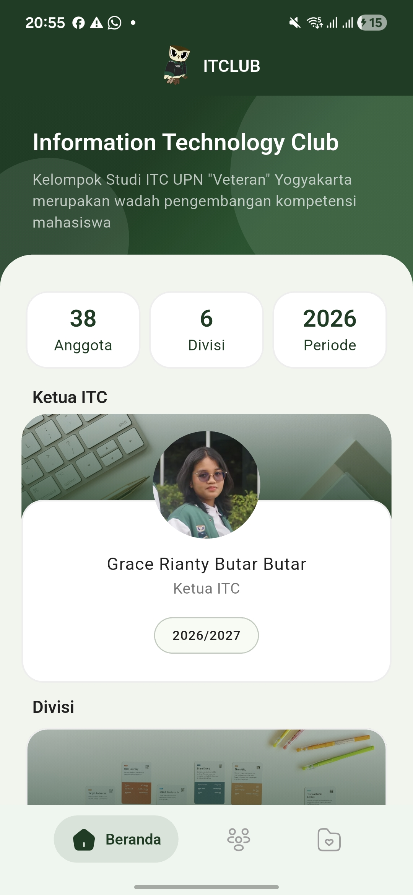
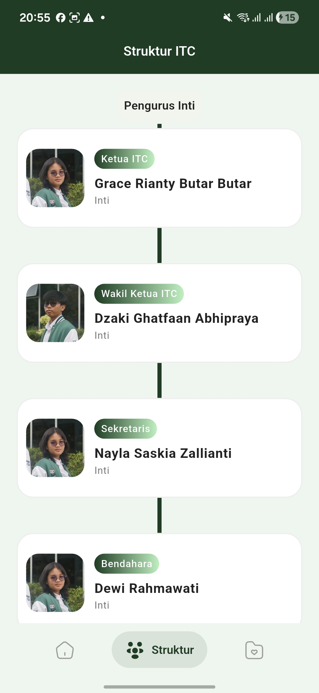
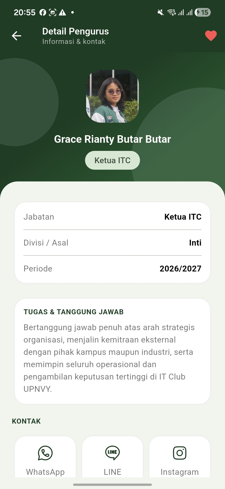
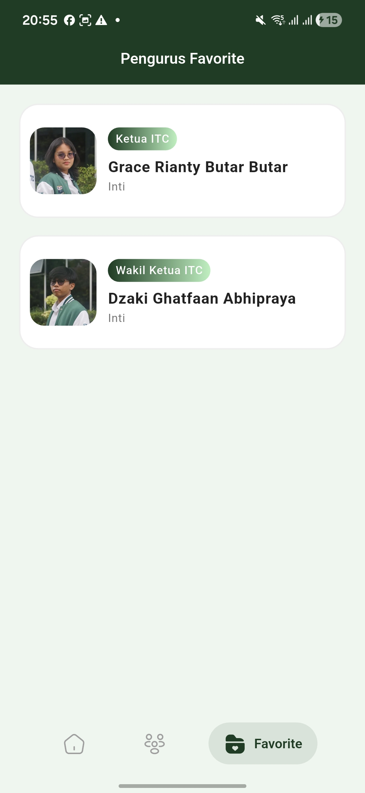

# ITC Directory

### itc-the-seeker-2026

Aplikasi mobile direktori pengurus Information Technology Club (ITC) UPN "Veteran" Yogyakarta periode 2026/2027. Dibuat sebagai submission seleksi The Seeker Mobile Development ITC 2026.

---

## Screenshots

| Home | Struktur | Detail | Favorit |
|:---:|:---:|:---:|:---:|
|  |  |  |  |

---

## Cara Menjalankan Aplikasi

### Prasyarat

- Flutter SDK ^3.11.5
- Dart SDK ^3.11.5
- Android Studio / VS Code
- Device Android atau Emulator (min. API 21)

### Langkah

1. Clone repository ini

```bash
   git clone https://github.com/devabrahmasta/itc-the-seeker-2026-Pande-Made-Deva-Brahmasta
```

2. Masuk ke direktori project

```bash
   cd itc-the-seeker-2026-Pande-Made-Deva-Brahmasta
```

3. Install dependencies

```bash
   flutter pub get
```

4. Jalankan aplikasi

```bash
   flutter run
```

### Build APK

```bash
flutter build apk --release
```

APK tersedia di `build/app/outputs/flutter-apk/app-release.apk`

---

## Fitur

- Halaman Home dengan highlight Ketua ITC, statistik organisasi, dan daftar divisi
- Halaman Struktur dengan pengelompokan Pengurus Inti dan Divisi Development via ExpansionTile
- Halaman Detail pengurus lengkap dengan tugas, jabatan, dan kontak cepat (WhatsApp, LINE, Instagram)
- Toggle favorit dengan penyimpanan persisten menggunakan SharedPreferences
- Halaman Favorit untuk melihat pengurus yang disimpan

---

## Tech Stack

- **Flutter** — framework utama
- **Provider** — state management
- **SharedPreferences** — persistensi data favorit
- **Google Fonts (Poppins)** — tipografi
- **Salomon Bottom Bar** — navigasi bawah
- **Iconsax Plus & Hugeicons** — ikon

## Arsitektur

Layer-first dengan pemisahan data, logic, dan UI:
lib/
├── data/ # dummy data (user_data.dart, division_data.dart)
├── models/ # UserModel
├── providers/ # MemberProvider
├── services/ # FavService (SharedPreferences)
├── pages/ # HomeScreen, StructureScreen, DetailScreen, FavoriteScreen
│ └── widgets/ # StructureCard, CircleWidget
└── themes/ # AppTheme

---

_Submission Seleksi The Seeker — Mobile Development ITC UPNYK 2026_
